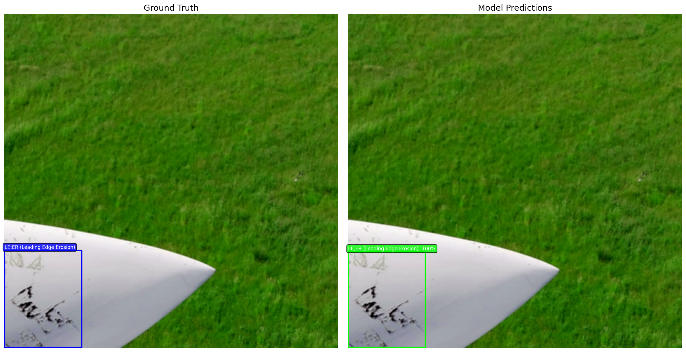
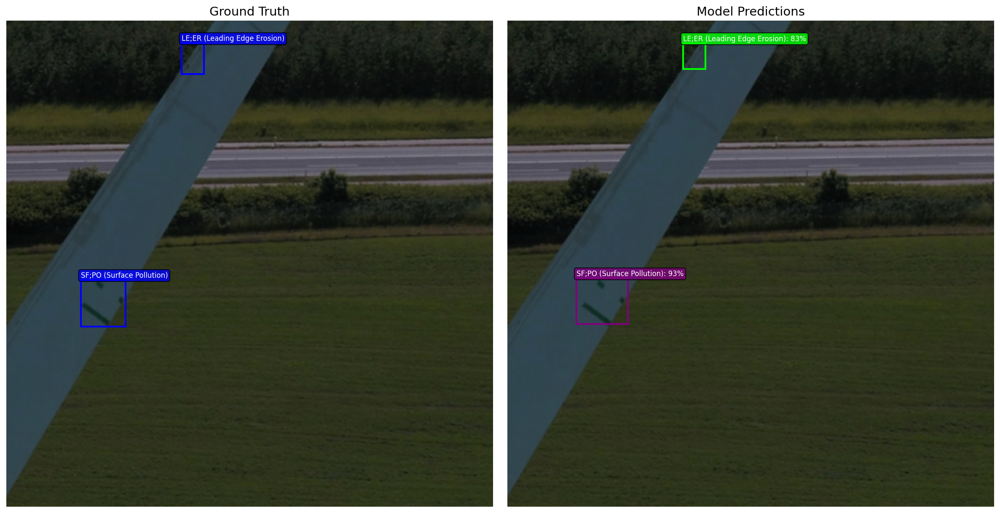
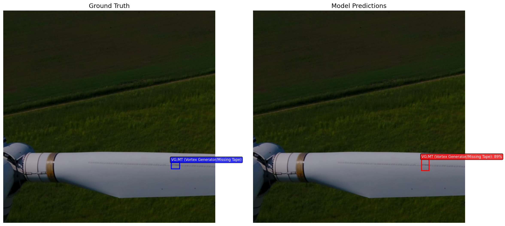

# Wind Turbine Defect Detection

Deep learning-based defect detection system for wind turbine blade inspection using drone imagery and Faster R-CNN.

## Overview

This project fine-tunes a **Faster R-CNN** model with a ResNet-50 FPN backbone on the DTU Wind Turbine dataset to detect 5 types of blade defects from drone-captured images.

## Defect Categories

| ID | Code | Description |
|----|------|-------------|
| 1 | VG;MT | Vortex Generator / Missing Tape |
| 2 | LE;ER | Leading Edge Erosion |
| 3 | LR;DA | Lightning Receptor Damage |
| 4 | LE;CR | Leading Edge Crack |
| 5 | SF;PO | Surface Pollution |

## Training Results (Baseline)

Results after 3 epochs of training on 340 images:

| Epoch | Total Loss | mAP | mAP@0.5 |
|-------|------------|-----|---------|
| 1 | 44.38 | - | - |
| 2 | 30.08 | - | - |
| 3 | 25.68 | 0.2186 | 0.5094 |

**Note:** With 30-50 epochs, expect mAP@0.5 of 0.6-0.8.

## Sample Detections

Below are example detections comparing ground truth annotations (left) with model predictions (right):







To generate new sample detection images:
```bash
python main.py --generate_samples
```

## Installation

### 1. Clone the Repository
```bash
git clone https://github.com/cthadeufaria/computer-vision-defect-detection.git
cd computer-vision-defect-detection
```

### 2. Create Virtual Environment
```bash
python3 -m venv venv
source venv/bin/activate  # On Windows: venv\Scripts\activate
```

### 3. Install Dependencies
```bash
pip install torch torchvision torchmetrics matplotlib pillow pycocotools tensorboard
```

## Dataset Setup

The dataset is automatically downloaded when you first run training. It includes:

1. **DTU Drone Inspection Images** (~2.5GB)
   - Source: [Mendeley Data](https://data.mendeley.com/datasets/hd96prn3nc/2)

2. **DTU Annotations** (COCO format)
   - Source: [GitHub - imadgohar/DTU-annotations](https://github.com/imadgohar/DTU-annotations)

### Dataset Structure
```
DTU - Drone inspection images of wind turbine/
├── DTU - Drone inspection images of wind turbine/
│   ├── Nordtank 2017/     # 286 images
│   └── Nordtank 2018/     # 398 images (used for training)
DTU-annotations-main/
├── re-annotation/
│   └── D3/
│       ├── train.json     # Training annotations
│       ├── test.json      # Test annotations
│       └── val.json       # Validation annotations
```

## Usage

### Training

```bash
source venv/bin/activate
python train_wind_turbine.py
```

**Configuration options** (edit `train_wind_turbine.py`):
- `num_epochs`: Number of training epochs (default: 30)
- `batch_size`: Batch size (default: 2, increase if you have more RAM)
- `lr`: Learning rate (default: 0.0001)

**Expected training time:**
- CPU: ~30-60 min/epoch
- CUDA GPU: ~5-10 min/epoch

### Monitoring with TensorBoard

Training metrics are automatically logged to TensorBoard:

```bash
tensorboard --logdir ./runs
```

Then open http://localhost:6006 in your browser to view:
- **Loss/epoch_total**: Total loss per epoch
- **Loss/batch_***: Individual loss components (classifier, box_reg, objectness, rpn_box_reg)
- **Metrics/mAP**: Mean Average Precision
- **Metrics/mAP_50**: mAP at 50% IoU threshold
- **Learning_Rate**: Learning rate schedule

### Inference

Run inference on images using the trained model:

```bash
python main.py --image path/to/image.jpg
```

Or run on a directory of images:
```bash
python main.py --input_dir path/to/images/ --output_dir path/to/results/
```

### Programmatic Inference

```python
from model import FasterRCNNModel
from PIL import Image
import torch
import torchvision.transforms as T

# Load model
model = FasterRCNNModel(num_classes=6)
model.load_state_dict(torch.load('./models/faster_rcnn_wind_turbine_v1.pth'))
model.eval()

# Prepare image
transform = T.Compose([
    T.Resize((1024, 1024)),
    T.ToTensor(),
    T.Normalize((0.5, 0.5, 0.5), (0.5, 0.5, 0.5))
])
image = transform(Image.open('image.jpg').convert('RGB'))

# Run inference
with torch.no_grad():
    predictions = model([image])

# Results
boxes = predictions[0]['boxes']      # Bounding boxes [x1, y1, x2, y2]
labels = predictions[0]['labels']    # Class IDs (1-5)
scores = predictions[0]['scores']    # Confidence scores (0-1)
```

## Model Outputs

Trained models are saved with versioning to prevent overwrites:
```
models/
├── faster_rcnn_wind_turbine_v1.pth
├── faster_rcnn_wind_turbine_v2.pth
└── ...
```

## Interpreting Results

### Loss Components
| Loss | Description | Good Value |
|------|-------------|------------|
| `loss_classifier` | Defect type classification | < 0.1 |
| `loss_box_reg` | Bounding box accuracy | < 0.1 |
| `loss_objectness` | Object vs background | < 0.1 |
| `loss_rpn_box_reg` | Region proposal accuracy | < 0.1 |

### Evaluation Metrics
| Metric | Description | Good Value |
|--------|-------------|------------|
| **mAP** | Mean Average Precision (all IoU) | > 0.3 |
| **mAP@0.5** | Precision at 50% IoU overlap | > 0.6 |

## Project Structure

```
computer-vision-defect-detection/
├── dataset.py              # Dataset loader with image slicing
├── model.py                # Faster R-CNN model definition
├── trainer.py              # Training and evaluation logic
├── train_wind_turbine.py   # Main training script
├── main.py                 # Inference script
├── models/                 # Saved model weights (versioned)
├── runs/                   # TensorBoard logs (versioned)
├── figures/                # Visualization outputs
└── missing_images.txt      # Log of missing dataset images
```

## Known Issues

1. **MPS (Apple Silicon) not supported**: Faster R-CNN hangs on Apple's Metal GPU. Use CPU or CUDA instead.

2. **Missing images**: 83 images referenced in annotations are from Nordtank 2017 but annotations expect Nordtank 2018. Training uses 340 valid images.

## License

MIT License - see [LICENSE](LICENSE) file.

## Acknowledgments

- DTU Wind Turbine Dataset: [Mendeley Data](https://data.mendeley.com/datasets/hd96prn3nc/2)
- Annotations: [imadgohar/DTU-annotations](https://github.com/imadgohar/DTU-annotations)
